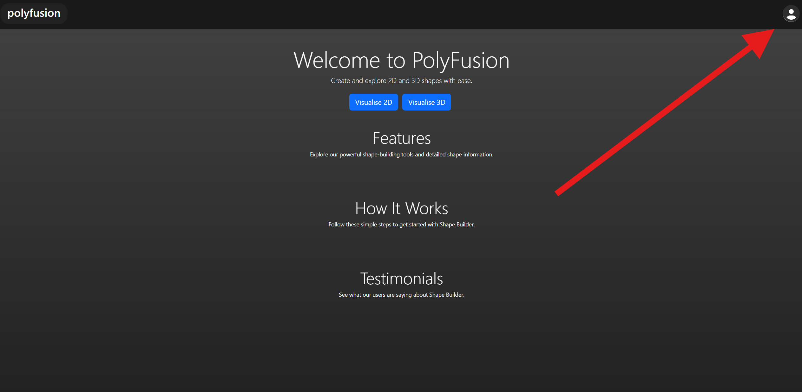

# User Authentication

By creating an account, a user can save their custom shapes to their account for later use.

Navigate to the top right corner of the web application.
Click on the Sign-Up icon.

If you already have an account, click on the Log-In hyperlink.

See: [Logging In](./log_in.md)

If you do not have an account, find the Sign-Up hyperlink on the Log-In page or the home page.

See: [Signing Up](./sign_up.md)
