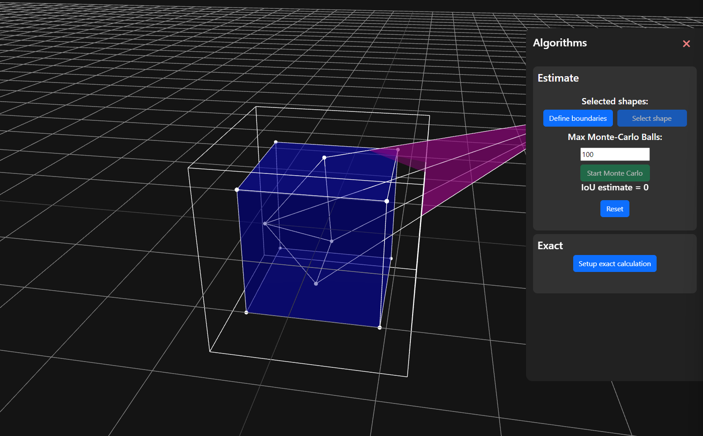
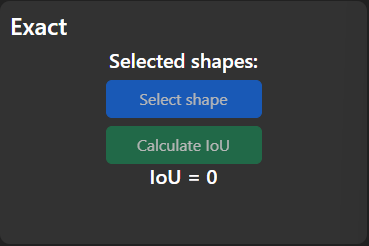

# Algorithms menu
There are two available algorithms to test IoU calculations for in PolyFusion. There is the Monte Carlo estimation and a Constructive Solid Geometry exact calculation.

The Monte Carlo algorithm allows a user to experiment and change around values to work out which parameters work best and to actually visualise the intersection area.

The Constructive Solid Geometry algorithm can then be used to see just how accurate the Monte Carlo estimation is compared to what the exact value turns out to be.
## Monte Carlo Algorithm
The Monte Carlo Algorithm works by spawning in a bunch of points randomly within a defined area. It then calculates the amount of balls which fall inside the intersection area, and the amount that fall outside of the intersection area. The accuracy of this algorithm improves with having a smaller spawning area and increasing the number of points to check.

The Algorithm is setup by pressing the 'Setup Monte Carlo' button. This creates a new 'Monte Carlo Box' which acts as the bounds for which the spawning of the algorithm can occur. This box can be moved, scaled, and rotated just as any other shape could be.

Once suitable boundaries have been defined, the user can select the 'Define boundaries button'. This does not lock the boundaries in place, they can be modified later if need be. You can then select each shape you would like to run the Monte Carlo estimate with (**Note**: minimum of 2 shapes is required for the Monte Carlo algorithm)

The number of Monte balls to use can also be defined here. The more balls, the more accurate the outcome but also the slower the run-time. It is up to the user to workout a suitable number for their use case, this is part of the learning experience.

While the algorithm runs, it will update the IoU estimate. Once it has completed, this number will be finalised. Monte Carlo can then be continued with further balls or reset.

<video width="750" autoplay loop src="./videos/20241010-0706-55.7816289.mp4" title="Monte Carlo running example"></video>

## Constructive Solid Geometry exact algorithm
This algorithm works by creating a Constructive Solid Geometry of the intersecting shapes and then calculating the volume of this shape. This method will always be exact and will also produce a new shape (the intersection) which can be modified and treated like any other shape.

This algorithm is initiated the same way, but there is no setup needed by the user.

All the user has to do is select the shapes they want to calculate the IoU for, and calculate it.

<video width="750" autoplay loop src="./videos/20241010-0717-16.7637009.mp4" title="Exact calculation example"></video>

This crated shape (from the volume intersection) can also be saved and used for further calculations if you would like. Performing a new exact calculation will delete the shape unless it has been saved already.