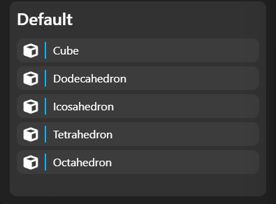
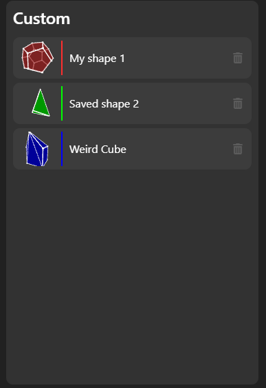

# Inserting Shapes
All shapes are added using the add shapes menu. This menu contains both preconfigured default shapes as well as custom shapes which can be saved by the end user.

## Default shapes
Default shapes are built into Polyfusion and act as the starting point for a user to create their own shapes. They can also be used exclusively to complete any task within PolyFusion you would like.

Above is the list of default shapes currently available within PolyFusion.
## Custom Shapes
Custom shapes are shapes which have been saved by an individual user. This includes any type of custom shape which a user has gone ahead and saved.

Shapes in this menu can be removed from the users account by clicking on the trash icon. This will remove that particular item from the list and from the users account entirely.

See: [Saving a shape](./saving_shapes.md)
