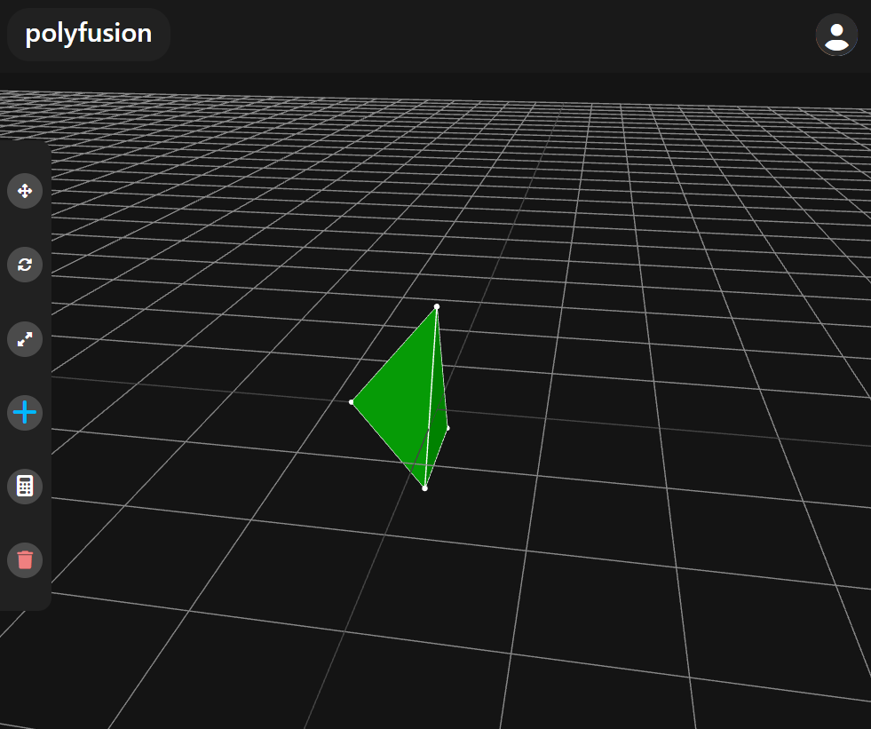

# 3D
Upon loading into the 3D page you will see what is called the '3D Canvas'.

This is what will display any shape you create and allow for you to interact with shapes within this 3-dimensional space.

This section will go through all the features at the users disposal and how to get the most out of Polyfusion.