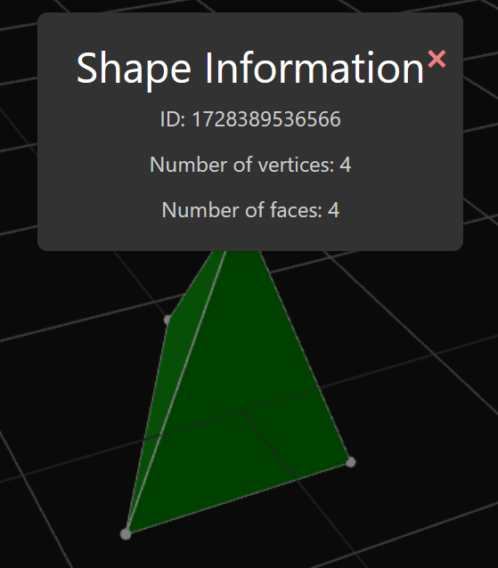

# Shape information menu
The shape information menu provides a small amount of extra data about the shape that has been selected. Most of this information is useful to more technical users and can be largely ignored by most users unless they are particularly interested in some aspects of a shape.

