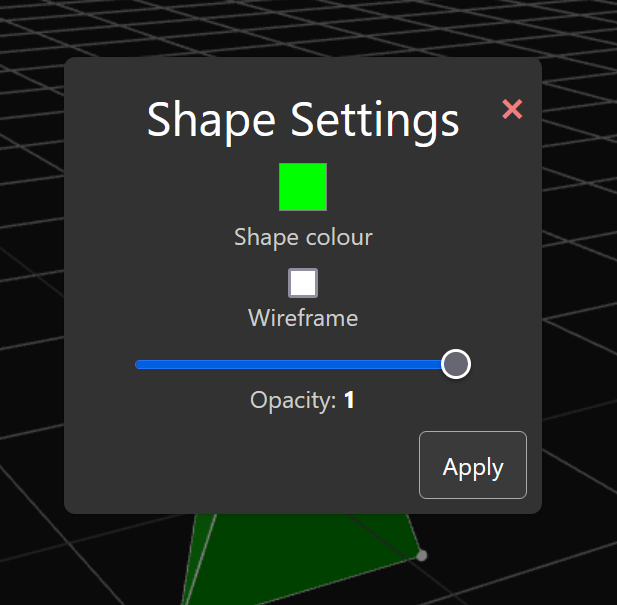

# Shape Settings
Each shape in the scene has unique settings which can be changed to alter the look and functionality of any shape.

## Accessing the shape settings menu
The shape settings menu can be accessed by right-clicking on any shape inside of the scene. The shape does not need to be selected before right clicking on it.

<video height="350" autoplay loop src="./videos/20241008-1215-40.9261764.mp4" title="Shape settings example"></video>

This will then bring up the shape settings menu.



## Settings breakdown
### Shape colour
This is the colour that will be used as a "material" on each face of the shape. It can be changed to absolutely any colour the user would want.

<video height="450" autoplay loop src="./videos/20241008-1220-51.4625958.mp4" title="Colour changing example"></video>

Hitting ```Apply``` will apply the colour to the selected shape. Exiting out of the menu at any time will discard any changes made inside the menu.

### Wireframe
Wireframe is a toggle for if the shape should be drawn with faces at all or just with lines connecting vertices (with vertices being drawn as well).

<video height="450" autoplay loop src="./videos/20241008-1224-14.3041201.mp4" title="Wireframe example"></video>

### Opacity
Opacity is similar to the wireframe setting in that it allows the user to see through the shape. Opacity however, keeps the faces of the shape visible. The opacity value controls the opacity of these faces.

<video height="450" autoplay loop src="./videos/20241008-1226-47.7457738.mp4" title="Opacity example"></video>